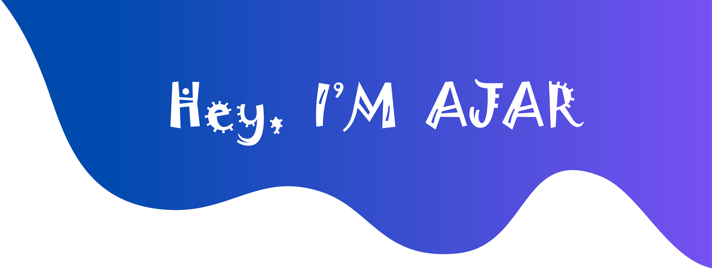

<h1 align="center">Computer Scientist</h1>

**`App Development | Machine Learning | Networking | Web Development | Game Development | Information Security | Cloud Computing`**
<h4 align="center">"An alchemist of the digital realm, I am a Computer Science Graduate with a fervor for coding and an eclectic skill set that spans the vast landscape of technology. From forging robust networks to breathing life into machine learning models, crafting captivating web experiences, molding mobile apps with finesse, conjuring immersive game worlds, safeguarding digital fortresses, to harnessing the power of the cloud, I am the architect of innovation and the guardian of data's sanctity. Let me be the bridge between your vision and the boundless possibilities of the digital universe."</h4>

  

🧑‍💼 About Me:

- 🔭 I did my FYP on [Sales Prediction on Store Using Machine Learning](https://youtu.be/O4Q-zW8cuLM)

- 👯 I’m looking to collaborate on **on a cutting-edge machine learning project that pushes the boundaries of AI and technology. If you share a passion for innovation and want to create something extraordinary, let's team up and make it happen!"**

- 🌱 I’m currently learning **WEB 3, Blockchain**

- 👨‍💻 All of my projects are available at [https://github.com/ajarkhalid/portfolio](https://github.com/ajarkhalid/portfolio)

- 💬 Ask me about **MERNSTACK, APP DEVELOPMENT, WEB DEVELOPMENT, GAME DEVELOPMENT, VIDEO EDITING, UI / UX**

- 📫 How to reach me **ajarkhalid@gmail.com**

- 📄 Know about my experiences [My Resume](https://www.dropbox.com/scl/fi/t8eun1dpqmug488ca6dmn/AJAR-KHALID-RESUME.pdf?rlkey=wlcr9z8i9jtqdqt3nqhynzmp8&dl=0)

⚡ Fun fact

 - **I embarked on my tech journey at the young age of 6, diving headfirst into the world of coding by the time I hit double digits at age 10. Since then, I've become the go-to tech whiz in both my family and college. Whenever someone needs a tech-savvy hand, I'm their first choice.**
-   🖥️ I have worked in IT for over half my life.
-   📊 I have developed and deployed over 70+ projects combined.
-   📚 I'm reading a book about financial technology to familiarize myself with the industry and its ongoing trends.
-   :musical_note: I love to hear Lo-Fi music.
-   👨‍💻Trusted troubleshooter for all things digital

### Let's Connect :coffee:

<h3 align="left">Languages and Tools:</h3>

                                                                        

